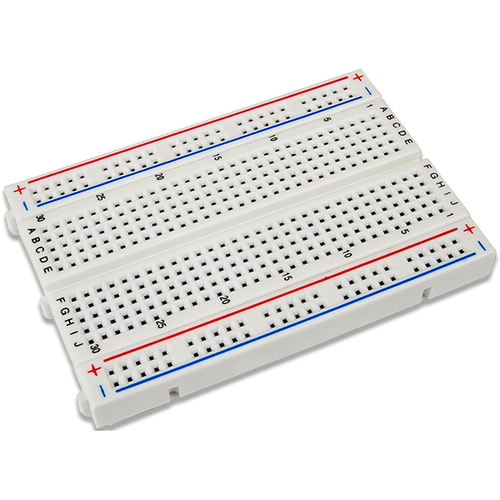
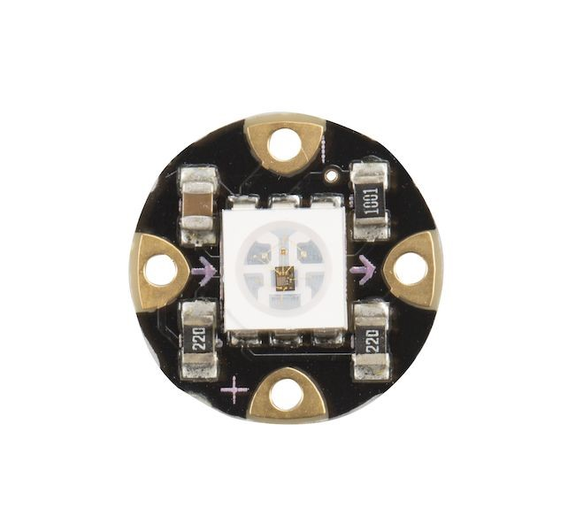
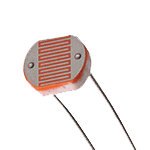
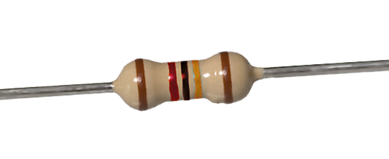
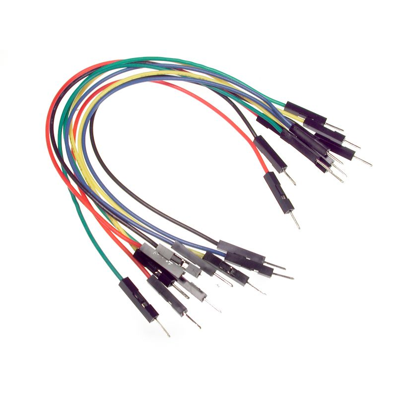
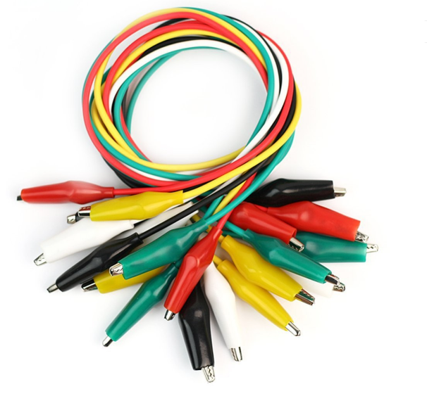
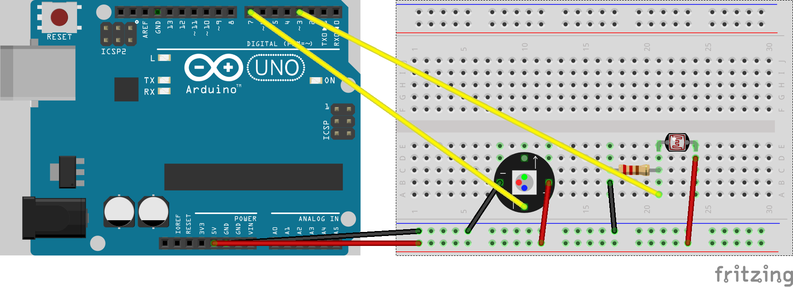

# Arduino workshop

## Goal:

---

## Material:

* Arduino Uno

* Breadboard

* Neopixel RGB v2

* Photocell (light sensor)

* Resistor

* Jumper wires

* Aligator clips

---

## Wiring the circuit:

---

### Test your circuit

* Download Adafruit Neopixel library
* Run `strandtest` sketch
* Neopixel should light up
* Upload custom sketch
* Turn on mobile phone's flashlight and point it to the photocell - the Neopixel should light up.
* Try chaining everyone's circuits to see if it works.

### Next steps

* Custom circuit with ATTiny chips

