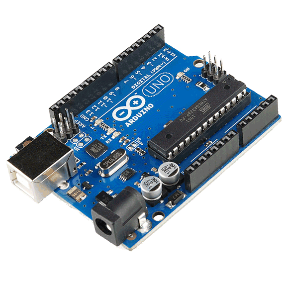

# Arduino workshop

## Goal:

---

## Material:

* Arduino Uno

* Breadboard

* Neopixel RGB v2

* Photocell (light sensor)

* Resistor

* Jumper wires

* Aligator clips

---

## Wiring the circuit:

---

### Test your circuit

* Download the [Arduino IDE](https://www.arduino.cc/en/Main/Software)
* Install the Adafruit Neopixel library:
  * Open the Arduino IDE.
  * In the menu bar: `Sketch > Include Library > Manage Libraries` and enter "Adafruit Neopixel".
  

  * You may have to close and re-open the IDE after installation.
* `File > Examples > Adafruit Neopixel > strandtest`
* Check that your board is selected in `Tools > Board` and `Tools > Port`
* Click on the upload button and the Neopixel should light up
* Upload the custom sketch `workshop.ino`
* Turn on mobile phone's flashlight and point it to the photocell - the Neopixel should light up.
* Try chaining everyone's circuits to see if it works.

### Next steps

* Custom circuit with ATTiny chips

